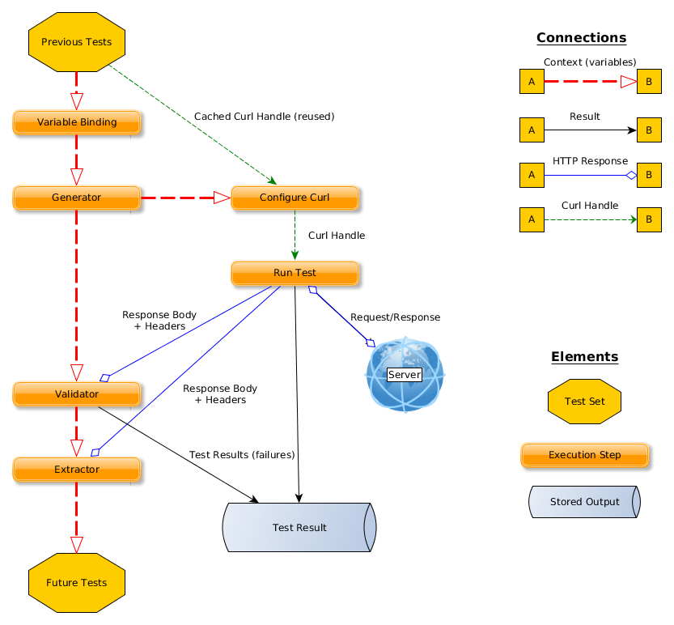

Advanced Guide For PyRestTest:
==========

This provides a more detailed guide to using the advanced features of PyRestTest.
Specifically **generators**, **variable binding,** **data extraction,** and **content validators.**

For how to write custom Python extensions, see the [extensions guide](extensions.md).

# How does it all fit together?


# Templating and Context Basics
- Tests and benchmarks may use variables to template out configuration dynamically.
- Templating is performed using basic [Python string templating](https://docs.python.org/2/library/string.html#template-strings).  
- Templating uses variables contained in a context, and **templates are evaluated freshly** for each test run or benchmark iteration
- Contexts are either passed into a test, or created in the text if not supplied
- **Contexts are persistent within a TestSet. Once a variable is set, it can be used in all following tests**
- **Context variables are modified and set** in 3 ways:
    1. **Variable values may be statically declared** with 'variable_binds' in TestSet config or the test
    2. **Generator output may be bound to a variable** with 'generator binds' in the test
        + Generators **must be declared by name** in the TestSet config for them to be used
        + Generator bindings evaluate once per HTTP call:
            - **Only once per Test**, and **multiple times for a Benchmark**
        + Generator bindings only apply to the Test/Benchmark they are declared in. New values are generated only when the binding is evaluated.
    3. **Data may be extracted from the HTTP response body** with the 'extract_binds' element in a test. 
        + Note that if the request fails, the data cannot be set (nothing to work with)
        + Currently, this is unsupported for benchmarks: using extraction doesn't make sense because benchmarks should be isolated.

## Templating, Generators, and Binding Example
What if you want to benchmark creating/updating a series of users, but the users must have unique IDs and logins?

*Easy-peasy with generators!*  You simply declare a number sequence generator, and bind it to the ID field for a PUT benchmark. 

To demonstrate static variable binding, this does binding for both first and last names too.

**Example:**
```yaml
---
- config:
    - testset: "Benchmark tests using test app"
    # Variables to use in the test set
    - variable_binds: {firstname: 'Gaius-Test', lastname: 'Baltar-Test'}
    # Generators to use in the test set
    - generators:  
        # Generator named 'id' that counts up from 10
        - 'id': {type: 'number_sequence', start: 10}

- benchmark: # create new entities
    - generator_binds: {user_id: id}
    - name: "Create person"
    - url: {template: "/api/person/$user_id/"}
    - warmup_runs: 0
    - method: 'PUT'
    - headers: {'Content-Type': 'application/json'}
    - body: {template: '{"first_name": "$firstname","id": "$user_id","last_name": "$lastname","login": "test-login-$id"}'}
    - 'benchmark_runs': '1000'
    - output_format: csv
    - metrics:
        - total_time: total
        - total_time: mean

```

Currently, templating is only supported for the request body, URL, and headers.
There are technical challenges adding it everywhere, it's coming as part of a rewrite of framework internals.

# Generators Listing
List of all generators and their configuration elements (required, optional, and meaning).

| Description                                                    | Name (in YAML): | Output Type | Parameters                                                                                                                                                                                                                                                       |
|----------------------------------------------------------------|-----------------|-------------|------------------------------------------------------------------------------------------------------------------------------------------------------------------------------------------------------------------------------------------------------------------|
| Environment Variable                                           | env_variable    | any         | required: 'variable_name', type: string (environment variable to use, no $ or % prefix)                                                                                                                                                                          |
| Environment String, with variable subsitution                  | env_string      | string      | required: 'string', type: string with env variables to substitute                                                                                                                                                                                                |
| Integer sequence                                               | number_sequence | integer     | optional: 'start', type: integer, default: 1 optional: 'increment', type: integer, default 1                                                                                                                                                                     |
| Integer - Random (32 bit)                                      | random_int      | integer     |                                                                                                                                                                                                                                                                  |
| Text - Random                                                  | random_text     | string      | optional: 'character set' OR 'characters', type: string, default: string.ascii_letters optional: 'min_length', type: integer, default: 8 optional: 'max_length', type: integer, default: 8 optional: 'length', (can either have length or min/min), type integer |
| Choice of random values from input list                        | choice          | any         | required: 'values',  type: array of anything                                                                                                                                                                                                                     |
| Sequence of values from input list of values, looping in order | fixed_sequence  | any         | required: 'values, type: array of anything                                                                                                                                                                                                                       |                                                                                                                                                                                                  |

## Additional Details For Generators
### env_variable: explanation
The variable name is used to lookup the environment variable. 
For example, if you used $HOST in a shellscript, the 'variable_name' value for the generator would be 'HOST'

### env_string: explanation
This is a string substitution with potentially multiple environment variables used. 
BASH: `echo "$USER logged into $HOSTNAME"`
becomes generator: 
```yaml
{type: 'env_string', 'string': "$USER logged into $HOSTNAME"}
``` 

### random_text: explanation
This generates strings of random characters.
All it needs is the:
- legal length ranges:
  + a 'length' sets it to a constant, fixed length
  + a 'min_length' and 'max_length' allow it to be randomly size, in that range

- valid characters to use, defined one of two ways:
  + a 'characters': you supply a list of valid characters to use, as a string
  + a 'character_set': a named character set of values, see below for table

### Character Sets Reference
Python internal character sets come from the [String constants](https://docs.python.org/2/library/string.html#string-constants) in the string module. 

**Reference:**

| Description                                                       | Text Name          | Source                                        |
|-------------------------------------------------------------------|--------------------|-----------------------------------------------|
| ASCII Letters, upper and lowercase, no whitespace                 | ascii_letters      | Python internal                               |
| ASCII Letters, lowercase, no whitespace                           | ascii_lowercase    | Python internal                               |
| ASCII Letters, uppercase only, no whitespace                      | ascii_uppercase    | Python internal                               |
| Digits, 0-9                                                       | digits             | Python internal                               |
| Hexadecimal digits, mixed upper and lowercase                     | hexdigits          | Python internal                               |
| Hexadecimal digits, all lowercase                                 | hex_lower          | string.digits+abcdef,                         |
| Hexadecimal digits, all uppercase                                 | hex_upper          | string.digits+ABCDEF,                         |
| Letters                                                           | letters            | Python internal, locale-dependent             |
| Lowercase letters                                                 | lowercase          | Python internal, locale-dependent             |
| Octal digits (0-7)                                                | octdigits          | Python internal                               |
| Punctuation characters, pipe plus !"#$%&'()*+,-./:;<=>?@[\]^_`{}~ | punctuation        | Python internal                               |
| All printable characters, includes whitespace                     | printable          | Python internal, locale-dependent             |
| Uppercase letters                                                 | uppercase          | Python internal, locale-dependent             |
| Whitespace characters                                             | whitespace         | Python internal, locale-dependent             |
| URL Slug characters (lowercase ASCII and dashes)                  | url.slug           | string.ascii_lowercase + string.digits + '-'  |
| URL Safe (unreserved characters from RFC3986)                     | url.safe           | string.ascii_letters + string.digits + '-~_.' |
| Alphanumeric                                                      | alphanumeric       | string.ascii_letters + string.digits          |
| Alphanumeric, lowercase only                                      | alphanumeric_lower | string.ascii_lowercase + string.digits        |
| Alphanumeric, uppercase only                                      | alphanumeric_upper | string.ascii_uppercase + string.digits        |


# Extractors Basics
Extractors are query-based ways to extract some part of an HTTP response body for use.

This can be used as part of a validator or to capture values to a context variable for later use. 

Current extractors are limited, but the functions are pluggable -- it is very easy to add full JsonPath, regex matching, xpath, xquery, etc and use them in your testing.

**An extractor definition looks like this:**
```yaml
extractor_name: extractor_configuration
```
Extractor configuration may be a simple string query, a templated string, or a more complex object.  It's completely up to the extractor parsing function how to handle this.

## Extractor: jsonpath_mini
The basic 'jsonpath_mini' extractor provides a very limited [JsonPath](http://goessner.net/articles/JsonPath/)-like implementation to grab data from JSON, with no external library dependencies.

The elements of this  syntax are a list of keys or indexes, descending down a tree, seperated by periods. Numbers are assumed to be array indices.

If you wish to return the whole object, you may use an empty "" query or "." -- this can be helpful for APIs returning an array of objects, where you want to count the number of objects returned (using countEq operator). 

**Example:**
Given this JSON:
```json
{
    "thing":{"foo":"bar"},
    "link_ids": [1, 2, 3, 4],
    "person":{
        "firstname": "Bob",
        "lastname": "Smith",
        "age": 17
    }
}
```

- This query: 'person.lastname'
Will return:  "Smith"

- This query: 'person.is_a_ninja'
Will return: NOTHING (None object) -- that key is not defined for 'person'.

- This query: 'link_ids.1'
 Will return: 2

- This query: 'thing'
Will return: {"foo":"bar"}

*Note that if you use this in templates it will appear as {u'foo': u'bar'} because it is converted to a python dictionary.*  If you with to use it in other tests, you will need to extract the component elements individually.

- This query: '.'
Will return: the whole response (as a python object). This can be very useful if you want to do contains or count operations on it.

- This query: 'thing.0'
Will return: None -- trick question, 'thing' is not an array!

Super simple, super basic, but it actually will cover a lot of useful cases. 

**This extractor also supports templating:**
```yaml
jsonpath_mini: {template: $keyname.age}
```

- If the context variable 'keyname' is set to 'person', this will return 17.
- If it is set to 'thing', then it will return nothing (because the 'thing' object lacks an 'age' key)

## Extractor: jmespath
The 'jmespath' extractor provides fulll [JMESPath](http://jmespath.org/) implementation to grab data from JSON and requires jmespath library to be available for import. Full range of JMESPath expressions is supported.

**Example:**
Given this JSON:
```json
{
   "test1" : {"a": "foo", "b": "bar", "c": "baz"},
   "test2" : {"a": {"b": {"c": {"d": "value"}}}},
   "test3" : ["a", "b", "c", "d", "e", "f"],
   "test4" : {
      "a": {
        "b": {
          "c": [
            {"d": [0, [1, 2]]},
            {"d": [3, 4]}
          ]
        }
      } },
   "test5" : [0, 1, 2, 3, 4, 5, 6, 7, 8, 9],
   "test6" : {
      "people": [
         {"first": "James", "last": "d"},
         {"first": "Jacob", "last": "e"},
         {"first": "Jayden", "last": "f"},
         {"missing": "different"}
      ],
      "foo": {"bar": "baz"}
   },
   "test7" : {
      "ops": {
         "functionA": {"numArgs": 2},
         "functionB": {"numArgs": 3},
         "functionC": {"variadic": 4}
      }
   },
   "test8" : {
      "reservations": [
         { "instances": [ {"state": "running"}, {"state": "stopped"} ] },
         { "instances": [ {"state": "terminated"}, {"state": "runnning"} ] }
      ]
   },
   "test9" : [ [0, 1], 2, [3], 4, [5, [6, 7]] ],
   "test10" : { "machines": [ {"name": "a", "state": "running"}, {"name": "b", "state": "stopped"}, {"name": "c", "state": "running"} ] },
   "test11" : {
      "people": [
         { "name": "b", "age": 30, "state": {"hired": "ooo"} },
         { "name": "a", "age": 50, "state": {"fired": "ooo"} },
         { "name": "c", "age": 40, "state": {"hired": "atwork"} } ]
   } ,
   "test12" : { "myarray": [ "foo", "foobar", "barfoo", "bar", "baz", "barbaz", "barfoobaz" ] }
}
```

| Query                           | Output                        |
|---------------------------------|-------------------------------|
| ```'test1.a'```                 | ```"foo"```                   |
| ```'test1.b'```                 | ```"bar"```                   |
| ```'test1.c'```                 | ```"baz"```                   |
| ```'test2.a.b.c.d'```           | ```"value"```                 |
| ```'test3[1]'```                | ```"b"``` |
|```'test4.a.b.c[0].d[1][0]'``` | ```1``` |
|```'length(test5[0:5])'``` | ```5``` |
|```'test5[1:3]'``` | ```'[1, 2]'``` |
|```'test5[::2]'``` | ```'[0, 2, 4, 6, 8]'``` |
|```'test5[5:0:-1]'``` | ```'[5, 4, 3, 2, 1]'``` |
|```'test6.people[*].first'``` | ```"['James', 'Jacob', 'Jayden']"``` |
|```'test6.people[:2].first'``` | ```"['James', 'Jacob']"``` |
|```'test6.people[*].first | [0]'``` | ```'James'``` |
|```'test7.ops.*.numArgs'``` | ```'[2, 3]'``` |
|```'test8.reservations[*].instances[*].state'``` | ```"[['running', 'stopped'], ['terminated', 'runnning']]"``` |
|```'test9[]'``` | ```'[0, 1, 2, 3, 4, 5, [6, 7]]'``` |
|```"test10.machines[?state=='running'].name"``` | ```"['a', 'c']"``` |
|```"test10.machines[?state!='running'][name, state] | [0]"``` | ```"['b', 'stopped']"``` |
|```'length(test11.people)'``` | ```3``` |
|```'max_by(test11.people, &age).name'``` | ```'a'``` |
|```"test12.myarray[?contains(@, 'foo') == `true`]"``` | ```"['foo', 'foobar', 'barfoo', 'barfoobaz']"``` |

## Extractor: header
This extracts the value of an HTTP header from the response. 
This value can be tested with comparisons or extract tests.
Note that **headers are case-insensitive**, 'content-type' and 'Content-Type' will be the same. If multiple values are defined for the header, a list of values will be returned (example: cookies).

Example:
```yaml
header: 'content-type'
```

Example 2:
```yaml
compare: {header: 'content-type', expected: 'application/json'}
```

## Extractor: raw_body
This extracts the raw HTTP response body. 
This value can be tested with comparisons or extract tests.
This does not take any configuration values. 

# Validation Basics
Validators test response bodies for correctness.  They perform a test on the response body, with context supplied, and return a value that will evaluate to boolean True or False. 

Optionally, validators can return a Failure which evaluates to False, but supplies additional information. 

## Current Validators:
### Extract and test value:
- **Name:** 'extract_test'
- **Description:** run an extractor to extract a value from the body and test it using a function.
- **Arguments:**
    + (extractor): an extractor definition, see above, named by extractor type
    + test: a test function to apply, which returns true or false (see list below)

- **Examples:**
```yaml
- validators:
    # Test key does not exist
    - extract_test: {jsonpath_mini: "key_should_not_exist",  test: "not_exists"}
```

#### Test Functions
'exists', 'not_exists' - check if there's a value or not


### Extract And Compare:
- **Name:** 'comparator' or 'compare' or 'assertEqual'
- **Description:** run an extractor and compare results to expected value
- **Arguments:**
    + (extractor): an extractor definition, see above, named by extractor type
    + comparator: a comparator function to apply, which returns true or false (see list below)
    + expected: value is:
        + expected value (a literal) 
        + a template: {template: 'template_string'} - gotcha here, you need to use 'str_eq' comparator if you want to template numeric values.
        + an extractor definition. Yes, you can compare two parts of the response body.

- **Examples:**
```yaml
- validators:
     # Check the user name matches
     - compare: {jsonpath_mini: "user_name", comparator: "eq", expected: 'neo'}
     
     # Check the total_count key has value over 10
     - compare: {jsonpath_mini: "total_count", comparator: "gt", expected: 10}
     
     # Check the user's login
     - compare: {jsonpath_mini: "total_count", comparator: "gt", expected: }
```


#### Comparator Functions:
| Name(s)                                      |                Description                | Details for comparator(A, B)                                           |
|----------------------------------------------|:-----------------------------------------:|------------------------------------------------------------------------|
| 'count_eq','length_eq'                       | Check length of body/str or count of elements equals value      | length(A) == B   or -1 if cannot obtain length   |
| 'lt', 'less_than':                           | Less Than                                 | A < B                                                                  |
| 'le', 'less_than_or_equal'                   | Less Than Or Equal To                     | A <= B                                                                 |
| 'eq', 'equals'                               | Equals                                    | A == B                                                                 |
| 'str_eq'                                     | Values are Equal When Converted to String | str(A) == str(B) -- useful for comparing templated numbers/collections |
| 'ne', 'not_equals'                           | Not Equals                                | A != B                                                                 |
| 'ge', 'greater_than_or_equal'                | Greater Than Or Equal To                  | A >= B                                                                 |
| 'gt', 'greater_than'                         | Greater Than                              | A > B                                                                  |
| 'contains'                                   | Contains                                  | B in A                                                                 |
| 'contained_by'                               | Contained By                              | A in B                                                                 |
| 'type'                                       | Type of variable is                       | A instanceof (at least one of) B
| 'regex'                                      | Regex Equals                              | A matches regex B                                                      |


##### Types for type test:

Map of name to types it will match
```python
TYPES = {
    'null': type(None),  # JSON null type
    'none': type(None),  # JSON null type
    'number': (int, long, float),  # JSON number type
    'int': (int, long),  # JSON number type if not a float
    'float': float, # JSON number type if a float
    'boolean': bool,   # JSON boolean
    'string': basestring,  # JSON string
    'array': list,  # JSON array
    'list': list,  # JSON array
    'dict': dict,  # JSON Object
    'map': dict,  # JSON Object
    'scalar': (bool, int, long, float, basestring, None),  # JSON any type but object or array
    'collection': (list, dict, set)  # JSON array or object
}
```

### JSONSchema Validator (Optional)
**Note:** this requires the 'jsonschema' python module to be installed. If not installed, you will be unable to use this validator, and an error message will be printed when tests are run (at "warn" log level).

- **Name:** json_schema
- **Description:** This validator lets you validate a request against a [JSON Schema - FIX LINK](Link here), which can be in the test body or an external file (as per the request body).
- **Arguments:** 
   + schema - the JSON schema to use in validating the request body
- **Examples:**

Validate against a schema in file 'miniapp-schema.json'
```yaml
---
- test:
    - url: /api/person/1/
    - validators:
        - json_schema: {schema: {file: 'miniapp-schema.json'}}
```

# Lifecycles Of Different Operations
## TestSet Execution Lifecycle
1. Parse command line arguments
2. Parse YAML, reading top-level imports and building TestSets
3. Execute TestSets:
    1. Generate a Context for each test set, populated with generators and variables defined in the TestConfig
    2. Run each test in the test set, using the context, per the test lifecycle below
        * Print failures as they occur
    3. Add statistics from that test to information for that test's group
    4. Run benchmarks in the test set, writing results to files
4. Print out collected test results, grouped by the test group name
5. Exit, returning response code with number of failed tests

## General Test Lifecycle
1. Update context before test (method update_context_before in the Test)
    1. Bind variables defined in the test into the context
    2. Bind generator values defined for that test into the context
2. Templating: realize() final version for that test, reading lazy-loaded files
3. Configure a Curl call, using info from the test and its configure_curl call
4. IF interactive mode: print info and wait for response
5. Execute the curl call
6. Update context after the test (extraction)
7. Run validators
8. Construct and return a TestResponse()

## General Benchmark Lifecycle
1. Pre-processing (set up to store metrics efficiently)
2. Warmup, runs *warmup_runs* times
    1. Update context before test (variable and generator binding) 
    2. Realize test templating
    3. Reconfigure a Curl call (curl objects are reused if possible)
    4. Run Curl
3. Benchmarking, runs *benchmark_runs* times
    1. Update context before test (variable and generator binding) 
    2. Realize test templating
    3. Reconfigure a Curl call (curl objects are reused if possible)
    4. Run Curl
    5. Collect metrics (adding to arrays)
4. Postprocessing: analyze benchmark results, condense arrays, and generate a BenchmarkResult object

###Key notes about benchmarks: 
* Benchmarks do as little as possible: they do NOT run validators or extractors
* HTTP response bodies are not stored, to get the most accurate result possible
* They do NOT currently check HTTP response codes (this may be added later)
* Benchmarks track a static failure count, to account for network issues
* Benchmarks will try to optimize out as much templating as they can safely. 


